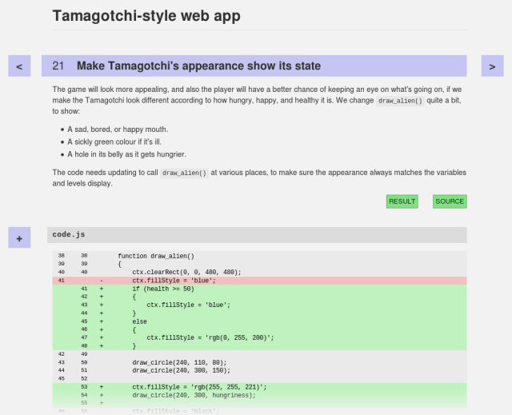
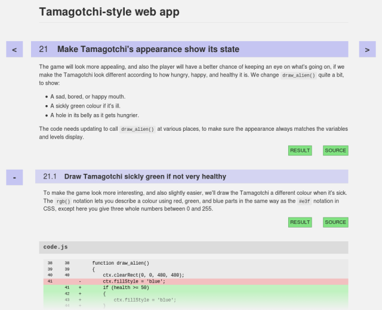

# Literate Git

Tool to render a hierarchical `git` history into HTML.

[](https://travis-ci.org/bennorth/literate-git)


## Motivation: Literate Programming

This project is a partner to my
[`git-dendrify`](https://github.com/bennorth/git-dendrify/) project,
which allows easy conversion between a *linear* form of git history, and
a *hierarchical* (tree-like) form.  The idea I am exploring in these
projects is that the presentation of the history of a piece of software
could benefit from the same hierarchical approach we use when writing an
article, paper, or other document.

We don't typically write a paper as one long flat stream of paragraphs,
but rather break it into sections and sub-sections.  I am exploring the
idea of presenting the development of a piece of software in the same
way, using a git repo with merge commits to represent the hierarchical
structure.

As noted in the
[git-dendrify write-up](https://github.com/bennorth/git-dendrify/blob/master/README.md),
unfortunately not all tools work well with a git history making heavy
use of such 'sections'.


## Presenting the hierarchical history

This project improves the situation by rendering a git history into an
HTML document which explicitly shows the hierarchical structure of the
code's development.

The document contains the commit messages (parsed as markdown to allow
some formatting), together with the source-code diffs.  Each 'top level'
commit becomes a 'section' in the HTML, which can be interacted with so
as to expand it into its constituent sub-commits.


## Demo

The best way to demonstrate the idea is with an example of the results:

 - [A Tamagotchi-style web app](http://www.redfrontdoor.org/20210314-literate-git-demo/index.html)
   &mdash; This is based on a course I developed and gave, jointly with
   Brian Gillespie, at a local primary school as a 'next step beyond
   [Scratch](https://scratch.mit.edu)' after-school course.  Note that
   'Tamagotchi' is a trademark of Bandai.

### Initial view

On paging through to an arbitrary section, using the `>` button, we
initially see this page (showing only the top portion):



### Expanded view

On clicking the `+` button, the presentation changes to show the
individual steps which make up this section:



There are eight subsections within *Make Tamagotchi's appearance show
its state*, as can be seen by
[playing with the demo](http://www.redfrontdoor.org/20210314-literate-git-demo/index.html).

### Interacting with the demo

In general, the 'RESULT' link opens a tab with the current state of the
web-app as of that commit, and the 'SOURCE' link opens a tab with GitHub
browsing the tree at that commit.  The very first commit's tree is empty
so RESULT gives an error but subsequent ones work.

You can navigate forward and backward in the history using the `>` and
`<` buttons.  You can also use vi-style `h` and `l` letter keys.

The `+` button to the left of the diff replaces it with its expansion in
terms of the sub-commits, with more explanation; the `-` button then
collapses back.

This sample only has one level of nesting but the idea would work for
deeper structures too.


## Installing

```
# via pip
pip install literategit

# via homebrew
brew install literate-git
```


## Usage of these rendering tools

This is still at the stage of a proof-of-concept, so the workflow is not
fully automated.  The two tools provided by this project are

 - `git literate-render`
 - `git dump-all-trees`

Using them, the steps to produce a rendered document are:

### Generate structured history

You can create the structured history yourself with careful merging,
but for this particular example, I developed the history in a linear
fashion and then 'dendrified' it using the
[`git-dendrify`](https://github.com/bennorth/git-dendrify/) project.
The dendrification was done with the command

<pre>git dendrify dendrify rendered-20210314 start bugfix/commit-messages-markdown-2</pre>

(And here we see one angle which will need more thought when this
system is used for a tutorial and the whole tutorial evolves &mdash;
what is a good way to track the history of the entire repo?  Including
version numbers or datestamps in the branch names is unlikely to be
the best solution.)

As a 'dog-food' example of the use of `git dendrify`, it was indeed
much easier to work in the linear form to re-structure, re-order, fix
typos, re-word, etc., while building up the structed history of this
tutorial.

### Generate HTML file: `git literate-render`

The single `index.html` file is generated by

<pre>git literate-render <i>title exclusive-begin-commit inclusive-end-commit create-url</i> &gt; index.html</pre>

where <code><i>inclusive-end-commit</i></code> is typically the head of
a branch which has been produced by `git dendrify` from a linear
history, and <code><i>exclusive-begin-commit</i></code> is the starting
point of the code just before the section you wish to present.

The use of the <code><i>create-url</i></code> argument is a bit clunky
&mdash; it specifies where the 'results' and 'source' links should point
to for the project being rendered.  Details in the code.

For this case it was

```bash
cd ~/dev/tamagotchi
mkdir /tmp/project-export
git literate-render "Tamagotchi-style web app" \
    start rendered-20210314 hard_coded_create_url.HardCodedCreateUrl \
    > /tmp/project-export/index.html
```

where `hard_coded_create_url.py` is a short special-case Python module
with a class `HardCodedCreateUrl` having functions providing links to
the 'results' trees (see next section) and the GitHub 'browse tree at
commit' pages.

### Generate 'results' trees: `git dump-all-trees`

As noted, the 'results' link takes you to the state of the web-app
project at that commit.  To generate the many different stages, this
project also includes a '**dump all trees**' tool.  One could imagine
instead generating some [JSBin](http://jsbin.com/) bins, or something
equivalent for projects in other languages.

This creates an output directory containing all relevant blobs, written
as loose files, and then also creates commit trees with hard-links to
the blobs.  This in similar to a subset of the functionality provided by
[gitfs](https://github.com/PressLabs/gitfs), but with the result being a
static set of snapshots.  It requires an operating system and filesystem
which supports the notion of a hard link.

For this case, the invocation was

```bash
git dump-all-trees /tmp/project-export start rendered-20210314
```

### Add support files

The various extra support files then need to be added to the export
directory.

```bash
cd ~/dev/literate-git/literategit
cp literate-git.css literate-git.js /tmp/project-export
( cd /tmp/project-export
  wget https://raw.githubusercontent.com/sindresorhus/github-markdown-css/gh-pages/github-markdown.css
  wget https://code.jquery.com/jquery-3.0.0.min.js )
```

### Source repo for this example

The hierarchical source branch for the example is:

 - [`rendered-20210314` branch of `bennorth/webapp-tamagotchi`](https://github.com/bennorth/webapp-tamagotchi/tree/rendered-20210314)

and, for comparison, the linear history is:

 - [`bugfix/commit-messages-markdown-2` branch of `bennorth/webapp-tamagotchi`](https://github.com/bennorth/webapp-tamagotchi/tree/bugfix/commit-messages-markdown-2)

Although see below under **GitHub limitation regarding commit sorting**.


## Observations and remarks

### Haskell LLVM tutorial

[Luke Lau](https://lukelau.me/) has turned the Kaleidoscope tutorial
from the LLVM project into a literate git history:

 - [llvm-hs Kaleidoscope tutorial](https://lukelau.me/kaleidoscope/)

### Other work

[Scott Abbey](https://www.sabbey.net/) has developed these ideas in
the direction of creating a 'presentation' version of an existing
public repo.  He took the Rust
[`semver-parser` crate](https://crates.io/crates/semver-parser),
re-wrote its commit history, and added detailed comments to explain
its development.  The result was a
['literate git' presentation](https://www.sabbey.net/litgit/semver-parser/).

Scott took a different approach to declaring the structure of the
commit history.  Instead of the 'magic strings in commit messages'
approach of `git-dendrify`, he applied tags to the commits.  The work
is described in more detail in
[Scott's write-up](https://www.sabbey.net/litgit/).

### GitHub limitation regarding commit sorting

Regrettably, GitHub shows commits in author-date order, which destroys
the carefully-built structure.  Apparently
[this behaviour is on purpose](https://help.github.com/articles/why-are-my-commits-in-the-wrong-order/),
with GitHub discouraging people from rebasing *even in private*.  This
is disheartening.

[Others also find GitHub's behaviour in this regard
annoying](https://github.com/isaacs/github/issues/386) &mdash; as
'toejough' comments in that issue, *It's not clear to me how only
showing things in the wrong order (where the 'right' order is the way
the committer ordered them during rebase) fosters better discussion.*

A better way to view these branches is to clone locally then use
something which understands the structure of the history, such as
[magit](https://magit.vc/) (which is truly **excellent**), or `gitk
--all`.

### Performance of rendering tools

Performance is pretty good, although the demo repo is fairly small.
There are 162 commits involved, and the different stages perform as
follows:

 - `dendrify` takes 0.14"
 - `literate-render` takes 1.0"
 - `dump-all-trees` takes 0.19"

### Graphic design

For this proof-of-concept, I based the styling heavily on GitHub's
markdown stylesheet (as available in [Sindre Sorhus's
project](https://github.com/sindresorhus/github-markdown-css)).

### Application to other languages

The 'results' link is an especially good fit for a web-app.  For other
projects, more thought might be required as to what this might mean.  Or
it could be optional.

### Preserve viewing state

It would be useful if the rendered result supported URLs going directly
to some particular section, in a chosen state (collapsed or expanded).


---

This README: Copyright 2016&ndash;2021 Ben North; licensed under
[CC BY-SA 4.0](http://creativecommons.org/licenses/by-sa/4.0/)

See the file `COPYING` for full licensing details.
